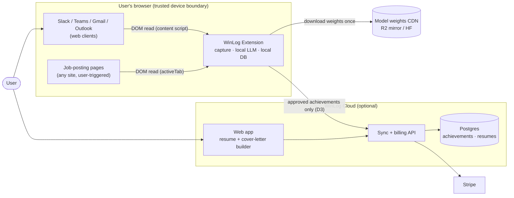
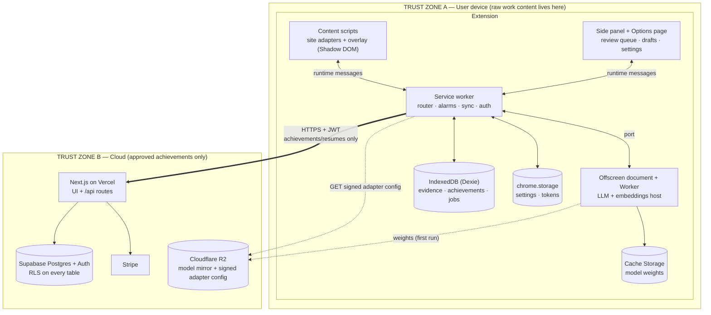
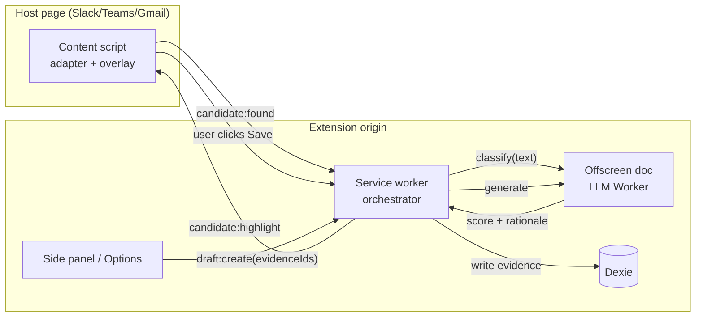
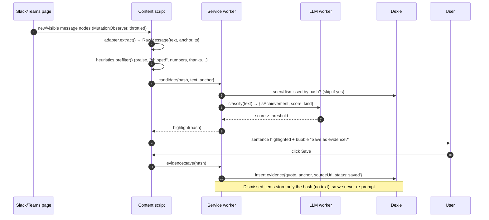
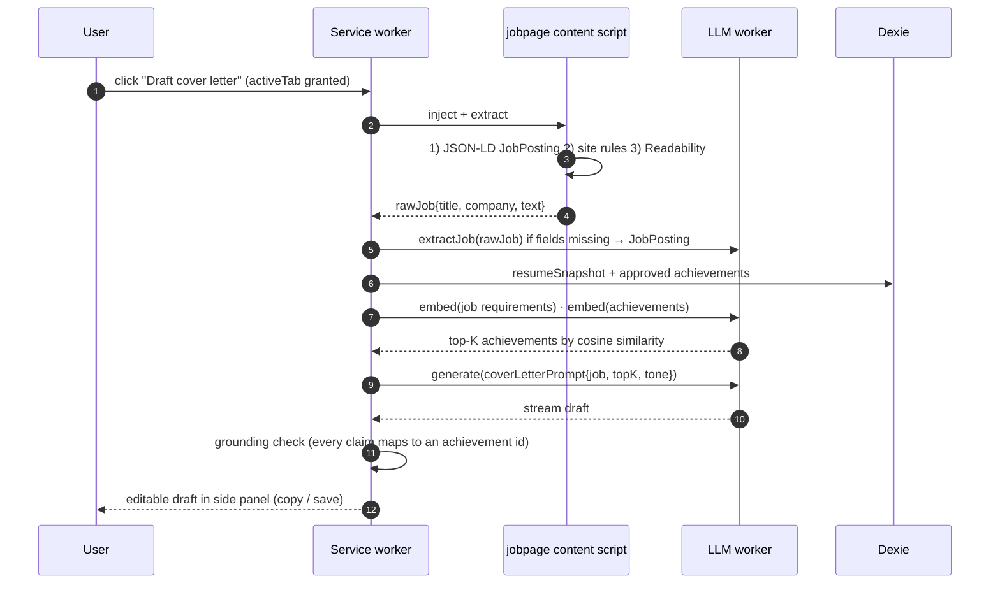
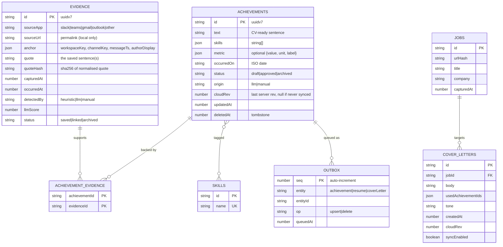
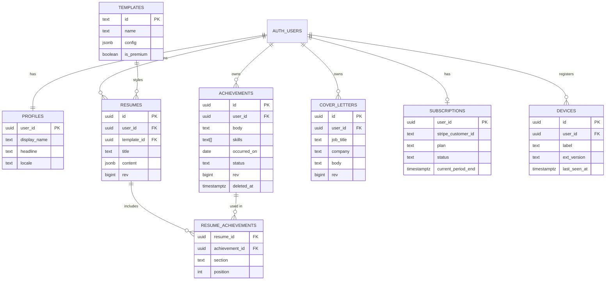
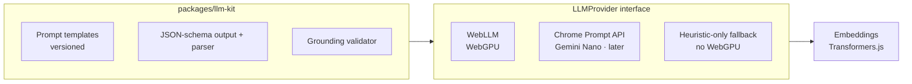

# WinLog — MVP Architecture Document

> Working name: **WinLog**. A local-first browser extension that captures work-achievement *evidence* from Slack / Teams / email, uses an on-device language model to draft CV-ready achievement sentences, and optionally syncs user-approved achievements to a web resume builder. The extension can also read a job-posting page and draft a cover letter from the user's resume — locally.

**Audience:** one founder + AI coding agents. **Bias:** lean, boring, cheap, secure by construction.
**Version pins:** versions named below are starting points — verify current releases (WXT, WebLLM, Next.js, Supabase) at project kickoff.

---

## 0. Locked design decisions

These come from the product constraints already decided; everything else follows from them.

| # | Decision | Consequence |
|---|----------|-------------|
| D1 | **All AI over raw work content runs on-device.** No cloud-AI fallback anywhere in the evidence path. | WebGPU/WASM model in the browser; heuristic fallback when hardware can't run it. No LLM API keys on any server. |
| D2 | **"Save as evidence" is a pointer, not an assertion.** Evidence keeps a link back to its original source; an *achievement* is a separate, user-approved claim that *references* evidence. | Two entities: `evidence` and `achievements`, joined many-to-many. |
| D3 | **The cloud only ever receives user-selected achievements** (plus resume/cover-letter content the user chooses to sync). Never raw Slack/Teams/email text, never source links by default. | Trust boundary sits between `evidence` (local) and `achievements` (syncable). Cloud schema has no evidence table. |
| D4 | **Resume builder is a separate cloud component.** Extension works fully offline/signed-out. | Sync is optional and additive; local DB is the source of truth for captured data. |
| D5 | **Lean:** one monorepo, one web deployable, one managed Postgres, no Kubernetes, no queues at MVP. | See the infrastructure spec for the growth path. |

---

## 1. Stack at a glance

| Layer | Choice | Why (lean rationale) |
|-------|--------|----------------------|
| Language | **TypeScript everywhere** | One language for extension, web, shared schemas; agents are strongest here. |
| Monorepo | **pnpm workspaces + Turborepo** | Shared types/schemas with zero publishing overhead. |
| Extension framework | **WXT** (Manifest V3, Vite) | Cross-browser builds (Chrome/Edge/Firefox), HMR, store-zip tooling. |
| Extension UI | **Preact/React + Tailwind**, content-script UI in **Shadow DOM** | Style isolation from Slack/Teams pages. |
| On-device LLM | **WebLLM** (WebGPU) running a ~1–1.5B instruct model, 4-bit (e.g. Qwen2.5-1.5B-Instruct or Llama-3.2-1B-Instruct class) | Runs in-browser, no install. Prebuilt model list changes — pick at build time. |
| On-device embeddings | **Transformers.js** + a small embedding model (MiniLM/bge-small class) | Ranks achievements against a job description without generation. |
| Optional LLM provider | Chrome built-in Prompt API (Gemini Nano) behind the same interface | Zero download where available. Post-MVP. |
| Local storage | **IndexedDB via Dexie** | Mature, typed, works in extension pages and service workers. |
| Web app | **Next.js (App Router)** + Tailwind + shadcn/ui | Resume builder UI, marketing pages, API routes in one deployable. |
| Cloud DB + Auth | **Supabase** (Postgres, Auth, Row-Level Security) | Auth + DB + RLS without writing an auth service. EU/UK region. |
| ORM / migrations | **Drizzle** schema + **Supabase CLI** SQL migrations | Typed queries; migrations are plain SQL you can review. |
| Validation | **Zod** (shared package) | Same schema validates extension→API payloads and DB writes. |
| PDF export | **Client-side** (print CSS / `@react-pdf/renderer`) | No server render cost; resume content never needs a PDF worker. |
| Payments | **Stripe** (Checkout + Customer Portal) | Hosted flows; webhook is the only server logic. |
| Email | **Resend** | Transactional only (auth is handled by Supabase). |
| Hosting | **Vercel** (web) + **Cloudflare** (DNS/CDN, R2 for model mirror) | Near-zero ops. |
| Errors / analytics | **Sentry** (web, scrubbed) + opt-in counters-only analytics in the extension | No content ever leaves the device in telemetry. |
| CI/CD | **GitHub Actions** | Test → migrate → deploy → store upload. |

---

## 2. System context



---

## 3. Containers and trust boundaries



**Rule of the boundary:** nothing from the `evidence` table, and no page text, crosses from Zone A to Zone B. Enforced by (a) the cloud having no table to put it in, (b) the sync module only serialising `achievements`, `resumes`, `cover_letters` (Zod allow-list), and (c) a CI test that fails if `evidence` is imported inside `sync/`.

---

## 4. Repository layout

```text
winlog/
├─ apps/
│  ├─ extension/                     # WXT project (MV3)
│  │  ├─ wxt.config.ts               # manifest, permissions, browser targets
│  │  ├─ entrypoints/
│  │  │  ├─ background.ts            # service worker: message router, alarms, sync, auth
│  │  │  ├─ offscreen/               # hidden page hosting the LLM worker
│  │  │  │  ├─ index.html
│  │  │  │  └─ llm.worker.ts
│  │  │  ├─ slack.content.ts         # content script per supported site
│  │  │  ├─ teams.content.ts
│  │  │  ├─ gmail.content.ts
│  │  │  ├─ outlook.content.ts
│  │  │  ├─ jobpage.content.ts       # injected on demand (activeTab) for job DOM parsing
│  │  │  ├─ sidepanel/               # review queue, drafts, cover-letter editor
│  │  │  └─ options/                 # settings, privacy controls, model manager, sign-in
│  │  ├─ src/
│  │  │  ├─ adapters/                # per-site DOM adapters (selectors + message extraction)
│  │  │  │  ├─ types.ts              # SiteAdapter interface
│  │  │  │  ├─ slack.ts  teams.ts  gmail.ts  outlook.ts
│  │  │  │  └─ config.ts             # loads + verifies signed remote selector config
│  │  │  ├─ detect/                  # candidate detection pipeline
│  │  │  │  ├─ heuristics.ts         # regex/keyword prefilter (cheap, always-on)
│  │  │  │  └─ classify.ts           # LLM scoring of prefiltered candidates
│  │  │  ├─ overlay/                 # bubble UI, highlight rendering (Shadow DOM)
│  │  │  ├─ jobs/                    # job extraction: JSON-LD → site rules → Readability+LLM
│  │  │  ├─ llm/                     # provider interface + WebLLM/Prompt-API implementations
│  │  │  ├─ db/                      # Dexie schema, migrations, repositories
│  │  │  ├─ sync/                    # outbox, push/pull, conflict handling
│  │  │  ├─ auth/                    # PKCE flow via identity API, token storage
│  │  │  ├─ messaging/               # typed message bus (zod-validated)
│  │  │  └─ privacy/                 # redaction, retention, export/delete-all
│  │  └─ tests/                      # vitest + playwright (fixture pages of Slack/Teams DOM)
│  └─ web/                           # Next.js app
│     ├─ app/
│     │  ├─ (marketing)/             # landing, pricing, privacy
│     │  ├─ (app)/                   # authenticated: achievements, resumes, templates, cover letters, settings
│     │  ├─ auth/callback/           # Supabase OAuth/PKCE return
│     │  └─ api/
│     │     ├─ sync/push/route.ts
│     │     ├─ sync/pull/route.ts
│     │     ├─ config/adapters/route.ts   # signed selector config
│     │     ├─ billing/checkout/route.ts
│     │     ├─ webhooks/stripe/route.ts
│     │     └─ account/route.ts      # export + delete
│     ├─ components/  lib/  templates/    # resume templates as React components + JSON config
│     └─ middleware.ts               # auth gate, security headers
├─ packages/
│  ├─ core/                          # zod schemas, shared types, sync protocol, id/time helpers
│  ├─ llm-kit/                       # prompts (versioned), output parsers, grounding validator, eval harness
│  ├─ db/                            # drizzle schema (cloud), generated types
│  └─ ui/                            # shared components (buttons, achievement card)
├─ supabase/
│  ├─ migrations/                    # timestamped .sql (source of truth for cloud schema)
│  ├─ seed.sql
│  └─ tests/                         # pgTAP RLS tests
├─ evals/
│  ├─ achievements.golden.jsonl      # labelled messages: is-achievement + expected sentence
│  ├─ coverletters.golden.jsonl
│  └─ run.ts                         # runs prompts against a local model, reports precision/recall
├─ infra/                            # wrangler.toml (R2), scripts/ (provision, rotate-keys)
├─ .github/workflows/                # ci.yml, deploy-web.yml, release-extension.yml
├─ docs/                             # this file, INFRASTRUCTURE_SPEC.md, ADRs/
├─ turbo.json  pnpm-workspace.yaml  package.json
└─ AGENTS.md                         # rules for coding agents (see §14)
```

### What each part does

| Part | Responsibility | Must **not** |
|------|----------------|--------------|
| `entrypoints/*.content.ts` | Run in the host page; find messages via adapters; render overlay; send candidates to the service worker. | Call the network; hold the LLM; store anything. |
| `background.ts` (service worker) | Single orchestrator: routes messages, owns the DB, schedules sync, manages auth tokens. Stateless between wake-ups (all state in Dexie/`chrome.storage`). | Keep in-memory state that matters; run inference. |
| `offscreen/` + `llm.worker.ts` | Hosts the WebLLM engine and embedding model in a Worker; exposes `generate / stream / embed` over a port. | Touch the DB or network (except weight download). |
| `adapters/` | Convert a site's DOM into normalised `RawMessage` objects with a stable source anchor. Isolated so Slack/Teams DOM changes only touch one file (plus remote config). | Contain business logic. |
| `detect/` | Two-stage funnel: cheap heuristics → LLM classification only on survivors. | Run the LLM on every message. |
| `jobs/` | Turn a job page into a `JobPosting` using JSON-LD `JobPosting` first, then site rules, then Readability + LLM extraction. | Persist page HTML. |
| `sync/` | Push outbox of approved achievements/resumes; pull deltas; handle conflicts. | Import from `evidence`. |
| `packages/core` | Single definition of every cross-boundary shape (Zod). | Depend on browser or Node APIs. |
| `packages/llm-kit` | Prompt templates, JSON-schema outputs, **grounding validator**, eval harness. | Know which runtime executes the model. |
| `apps/web` | Resume/cover-letter builder, billing, account, sync endpoints. | Ever receive evidence or run LLMs. |
| `supabase/` | Schema, RLS, tests — the contract for cloud data. | Be edited via the dashboard (migrations only). |

---

## 5. Extension internals

### 5.1 Execution contexts



Why this shape:

- **Service workers die after ~30 s idle** in MV3, so they hold no state and no model. They are a router + DB owner.
- **Model hosting** lives in an offscreen document with a dedicated Worker (WebLLM supplies an extension-oriented engine wrapper for this pattern). Create it on demand, keep it alive while a job queue is non-empty, and rely on **Cache Storage** so reloads after eviction take seconds, not a re-download. Verify offscreen-document lifetime rules at build time; if needed, host the engine in the side panel page instead and queue background work for when it is open.
- **Content scripts are thin**: DOM in, candidates out.

### 5.2 Capture pipeline (the heart of the product)



**Cost control:** heuristic prefilter removes ~95% of messages; classification runs on a small queue with a concurrency of 1 and pauses when the tab is hidden or battery is low. A per-day cap is configurable.

### 5.3 Evidence → achievement (draft)

1. User selects one or more evidence items in the side panel → **Draft sentence**.
2. `llm-kit` builds a prompt: *only* the quoted evidence + optional user note; output JSON `{text, skills[], metric?}`.
3. **Grounding validator** rejects any draft containing numbers, named entities, or percentages not present in the evidence/user note; one retry, then fall back to a plain extractive sentence.
4. Draft lands as `achievements.status = 'draft'`, linked to its evidence via `achievement_evidence`. The user edits and **approves**; only approved achievements are eligible to sync (D3).

### 5.4 Job page → cover letter



The job page is read **only** after an explicit click via `activeTab` + `scripting`, so the extension needs **no broad host permissions** — which also keeps Chrome Web Store review simpler. Job text is processed in memory; only `{title, company, urlHash}` is stored.

---

## 6. Where state lives

| State | Location | Durability | Syncs to cloud? |
|-------|----------|------------|-----------------|
| Evidence (quotes, source anchors) | Dexie `evidence` | Persistent, device-local | **Never** |
| Dismissed-candidate hashes | Dexie `dismissals` | Persistent | Never |
| Achievements (draft/approved) | Dexie `achievements` | Persistent | **Approved only**, via outbox |
| Evidence↔achievement links | Dexie `achievementEvidence` | Persistent | **Never** (links reference local evidence ids) |
| Resume snapshots (pulled from cloud) | Dexie `resumeSnapshots` | Cache; re-pullable | Source of truth is cloud |
| Job postings (minimal) | Dexie `jobs` | Persistent, prunable | Never |
| Cover letters | Dexie `coverLetters` | Persistent | Opt-in per letter |
| Sync cursor, outbox | Dexie `syncState`, `outbox` | Persistent | n/a |
| Settings, thresholds, per-site toggles | `chrome.storage.local` | Persistent | No |
| Auth tokens | `chrome.storage.session` (access) + `chrome.storage.local` (refresh) | Session / persistent | n/a |
| Model weights | Cache Storage | Evictable | No (downloaded from R2/HF) |
| Inference queue, in-flight jobs | Memory in offscreen worker | Volatile | No |
| Resumes, templates, achievements (canonical synced copy) | Supabase Postgres | Backed up | — |
| Subscriptions | Postgres, written only by Stripe webhook | Backed up | — |
| UI session state (selected tab, drafts in editor) | Component state | Volatile | No |

---

## 7. Local data model (Dexie / IndexedDB)



```ts
// apps/extension/src/db/schema.ts
import Dexie, { Table } from "dexie";

export class WinLogDB extends Dexie {
  evidence!: Table<Evidence, string>;
  dismissals!: Table<{ hash: string; at: number }, string>;
  achievements!: Table<Achievement, string>;
  achievementEvidence!: Table<{ achievementId: string; evidenceId: string }, [string, string]>;
  skills!: Table<{ id: string; name: string }, string>;
  jobs!: Table<Job, string>;
  coverLetters!: Table<CoverLetter, string>;
  resumeSnapshots!: Table<ResumeSnapshot, string>;
  outbox!: Table<OutboxItem, number>;
  syncState!: Table<{ key: string; value: unknown }, string>;

  constructor() {
    super("winlog");
    this.version(1).stores({
      evidence: "id, capturedAt, sourceApp, status, &quoteHash",
      dismissals: "hash, at",
      achievements: "id, status, updatedAt, occurredOn, *skills",
      achievementEvidence: "[achievementId+evidenceId], evidenceId",
      skills: "id, &name",
      jobs: "id, urlHash, capturedAt",
      coverLetters: "id, jobId, createdAt",
      resumeSnapshots: "id, cloudRev",
      outbox: "++seq, [entity+entityId]",
      syncState: "key",
    });
  }
}
```

**Migrations:** Dexie `version(n).upgrade()` for every change; never edit a shipped version. Ship a `db:export` / `db:import` (JSON) from day one — it's your user-facing backup for a local-first product.

**Retention (privacy control):** configurable auto-purge for evidence (default: keep until user deletes), and a one-click "Delete all local data".

---

## 8. Cloud data model (Postgres on Supabase)



```sql
-- supabase/migrations/0001_init.sql  (abridged but runnable)

create sequence sync_rev_seq;

create or replace function set_rev() returns trigger language plpgsql as $$
begin
  new.rev := nextval('sync_rev_seq');
  new.updated_at := now();
  return new;
end $$;

create table profiles (
  user_id      uuid primary key references auth.users(id) on delete cascade,
  display_name text,
  headline     text,
  locale       text default 'en-GB',
  created_at   timestamptz not null default now()
);

create table templates (
  id         text primary key,
  name       text not null,
  config     jsonb not null,
  is_premium boolean not null default false
);

create table achievements (
  id          uuid primary key,                       -- client-generated uuidv7
  user_id     uuid not null references auth.users(id) on delete cascade,
  body        text not null check (char_length(body) between 1 and 600),
  skills      text[] not null default '{}',
  metric      jsonb,
  occurred_on date,
  status      text not null check (status in ('approved','archived')),  -- drafts never sync
  rev         bigint not null,
  created_at  timestamptz not null default now(),
  updated_at  timestamptz not null default now(),
  deleted_at  timestamptz                              -- tombstone for sync
);
create index achievements_user_rev on achievements (user_id, rev);

create table resumes (
  id          uuid primary key,
  user_id     uuid not null references auth.users(id) on delete cascade,
  template_id text references templates(id),
  title       text not null,
  content     jsonb not null,                          -- header, summary, experience blocks, education…
  rev         bigint not null,
  created_at  timestamptz not null default now(),
  updated_at  timestamptz not null default now(),
  deleted_at  timestamptz
);
create index resumes_user_rev on resumes (user_id, rev);

create table resume_achievements (
  resume_id      uuid not null references resumes(id) on delete cascade,
  achievement_id uuid not null references achievements(id) on delete cascade,
  section        text not null,                        -- e.g. experience entry key
  position       int  not null,
  primary key (resume_id, achievement_id)
);

create table cover_letters (
  id         uuid primary key,
  user_id    uuid not null references auth.users(id) on delete cascade,
  job_title  text,
  company    text,
  body       text not null,
  rev        bigint not null,
  created_at timestamptz not null default now(),
  updated_at timestamptz not null default now(),
  deleted_at timestamptz
);
create index cover_letters_user_rev on cover_letters (user_id, rev);

create table subscriptions (
  user_id              uuid primary key references auth.users(id) on delete cascade,
  stripe_customer_id   text unique not null,
  plan                 text not null default 'free',
  status               text not null default 'inactive',
  current_period_end   timestamptz,
  updated_at           timestamptz not null default now()
);

create table devices (
  id           uuid primary key,
  user_id      uuid not null references auth.users(id) on delete cascade,
  label        text,
  ext_version  text,
  last_seen_at timestamptz not null default now()
);

create table consent_log (        -- evidence of what the user agreed to and when
  id        bigint generated always as identity primary key,
  user_id   uuid not null references auth.users(id) on delete cascade,
  kind      text not null,        -- 'terms','privacy','sync_enabled','analytics'
  version   text not null,
  at        timestamptz not null default now()
);

-- rev triggers
create trigger achievements_rev  before insert or update on achievements  for each row execute function set_rev();
create trigger resumes_rev       before insert or update on resumes        for each row execute function set_rev();
create trigger cover_letters_rev before insert or update on cover_letters  for each row execute function set_rev();

-- Row-Level Security: every table, no exceptions
alter table profiles            enable row level security;
alter table achievements        enable row level security;
alter table resumes             enable row level security;
alter table resume_achievements enable row level security;
alter table cover_letters       enable row level security;
alter table subscriptions       enable row level security;
alter table devices             enable row level security;
alter table consent_log         enable row level security;

create policy own_rows on profiles     for all using (user_id = auth.uid()) with check (user_id = auth.uid());
create policy own_rows on achievements for all using (user_id = auth.uid()) with check (user_id = auth.uid());
create policy own_rows on resumes      for all using (user_id = auth.uid()) with check (user_id = auth.uid());
create policy own_rows on cover_letters for all using (user_id = auth.uid()) with check (user_id = auth.uid());
create policy own_rows on devices      for all using (user_id = auth.uid()) with check (user_id = auth.uid());
create policy own_read on consent_log  for select using (user_id = auth.uid());
create policy own_read on subscriptions for select using (user_id = auth.uid());   -- writes: service role only (Stripe webhook)
create policy own_rows on resume_achievements for all
  using (exists (select 1 from resumes r where r.id = resume_id and r.user_id = auth.uid()));
-- templates: readable by all authenticated users
alter table templates enable row level security;
create policy read_all on templates for select using (auth.role() = 'authenticated');
```

**Design notes**

- `status` on the cloud `achievements` table excludes `draft` — drafts physically cannot sync.
- No `evidence` table and no source-URL column exist in the cloud (D3).
- `rev` is a global monotonic sequence stamped by trigger; clients page deltas with `rev > cursor`. This avoids clock-skew bugs.
- Resume `content` is JSONB for template flexibility; validated by the shared Zod schema in `packages/core`.
- pgTAP tests in `supabase/tests` assert that user A can never read or write user B's rows on every table — run in CI.

---

## 9. Sync protocol

Local-first, optional, **outbox → push → pull**.

```mermaid
sequenceDiagram
    autonumber
    participant EXT as Extension (sync module)
    participant API as /api/sync
    participant PG as Postgres (RLS)

    Note over EXT: User approves achievement → row + outbox entry
    EXT->>API: POST /push {deviceId, items:[{entity,id,op,baseRev,data}]}
    API->>API: verify JWT, zod-validate (allow-listed entities only)
    API->>PG: upsert per item (user JWT → RLS enforced)
    alt baseRev matches current rev
        PG-->>API: new rev
    else conflict (server changed since baseRev)
        PG-->>API: current row
        API-->>EXT: conflict{serverRow}
        EXT->>EXT: keep newer updatedAt; surface "conflict copy" if both edited text
    end
    API-->>EXT: {results:[{id, rev}]}
    EXT->>EXT: clear outbox, store cloudRev
    EXT->>API: GET /pull?since=cursor&limit=200
    API->>PG: select … where user_id=$1 and rev>$cursor order by rev
    PG-->>API: rows (incl. tombstones)
    API-->>EXT: {items, nextCursor}
    EXT->>EXT: apply to Dexie, advance cursor
```

- **Cadence:** on approval (debounced 5 s), on browser start, on web-app-open signal, and a 15-minute alarm. Pull uses `ETag`/`304` when nothing changed.
- **Idempotency:** client UUIDv7 ids + upserts → retrying a push is always safe.
- **Deletes:** tombstones (`deleted_at`), purged server-side after 90 days.
- **Scope:** `achievement`, `resume`, `coverLetter` only. The push payload schema is a Zod *allow-list*; unknown fields are stripped.

### API surface

| Endpoint | Auth | Purpose |
|----------|------|---------|
| `POST /api/sync/push` | Bearer JWT | Batch upsert/delete (≤100 items, ≤256 KB). |
| `GET /api/sync/pull` | Bearer JWT | Delta since cursor. |
| `GET /api/config/adapters` | Public, cached | Signed (ed25519) selector/heuristic config for site adapters. Data, not code. |
| `POST /api/billing/checkout` | Session | Creates Stripe Checkout session. |
| `POST /api/webhooks/stripe` | Stripe signature | Upserts `subscriptions` using service role. |
| `GET/DELETE /api/account` | Session | Full export (JSON) and account + data deletion. |

### Auth between extension and web

`chrome.identity.launchWebAuthFlow` → Supabase Auth OAuth with **PKCE** → tokens held by the service worker. The web app and extension share one Supabase identity; the extension never sees the service-role key. Sign-out clears tokens but **keeps local data** unless the user chooses "sign out and wipe".

---

## 10. On-device LLM subsystem



```ts
// packages/llm-kit/src/provider.ts
export interface LLMProvider {
  ready(): Promise<{ ok: boolean; reason?: "no-webgpu" | "no-model" | "low-memory" }>;
  generate(req: { system: string; user: string; json?: JsonSchema; maxTokens: number }): Promise<string>;
  stream(req: GenerateReq): AsyncIterable<string>;
  embed(texts: string[]): Promise<Float32Array[]>;
}
```

| Task | Model usage | Safety rails |
|------|-------------|--------------|
| Is this sentence an achievement? | Constrained JSON `{isAchievement, score, kind}`; temperature 0 | Threshold tuned on `evals/`; user can adjust sensitivity. |
| Evidence → achievement sentence | Short generation from quoted evidence only | **Grounding validator**: numbers/entities must appear in input; else retry once, then extractive fallback. |
| Job page → structured posting | JSON extraction only when JSON-LD/site rules fail | Output schema-validated; failures fall back to showing raw text for manual paste. |
| Achievement ranking vs job | Embeddings + cosine similarity (no generation) | Deterministic and fast. |
| Cover letter | Generation from top-K achievements + job + resume header | Every claim must map to an achievement id; unsupported sentences are flagged in the UI. |

**Tiering by hardware:** detect WebGPU + memory at first run → recommend model size (≈0.5B / 1.5B / 3B class). No WebGPU → capture still works with heuristics + manual save; drafting becomes an extractive template. Be honest in the UI about this; it is a real adoption constraint on older corporate laptops.

**Model delivery:** weights downloaded on first run (progress UI, resumable), cached in Cache Storage. Mirror to Cloudflare R2 once volume justifies it (zero egress fees); until then the upstream hub is fine. Weights are data, not code, so they do not conflict with MV3's no-remote-code rule.

**Quality loop:** `evals/` holds a labelled golden set you grow from your own work messages (synthetic/anonymised only — never commit real ones). `pnpm eval` runs prompts against a local model of the same family and quantisation and prints precision/recall + grounding-failure rate. Gate prompt changes on it in CI.

---

## 11. Security & privacy design

| Area | Control |
|------|---------|
| Permissions | Static content-script matches limited to supported domains; job pages via `activeTab` + `scripting`; `storage`, `identity`, `alarms`, `offscreen`, `sidePanel`, `unlimitedStorage`. No `<all_urls>`. |
| Data minimisation | Evidence local-only; dismissals hash-only; job HTML never stored; telemetry opt-in, counters only. |
| Remote config | Selector/heuristic JSON signed with ed25519; public key baked into the extension; reject unsigned/older versions. |
| Extension hardening | Strict extension CSP, no `eval`, Shadow DOM for injected UI, all runtime messages Zod-validated and sender-checked. |
| Cloud | RLS on all tables + pgTAP tests; service-role key only in the Stripe webhook route; rate limits on `/api/sync/*`; HSTS/CSP headers. |
| At-rest (device) | Browser-profile storage; optional passphrase-encrypted evidence (WebCrypto AES-GCM, key derived via PBKDF2/Argon2-WASM) as a post-MVP option. |
| Compliance | UK/EU region, DPA with processors (Supabase, Vercel, Stripe, Resend), account export + delete endpoints, consent log. |
| Employer-risk | Capturing work chat can conflict with an employer's policies or DLP tooling. Make capture **per-site opt-in**, show a clear first-run explainer, and avoid capturing from other people's private DMs by default. Have a solicitor review the privacy policy and Slack/Microsoft terms exposure before public launch (this document is not legal advice). |

---

## 12. MVP scope

**In (v0.1):**
- Slack (web) + Teams (web) adapters; Gmail/Outlook as stretch.
- Heuristic prefilter + LLM classifier + highlight bubble + "Save as evidence".
- Evidence library with source links, side-panel review queue, draft → approve achievements.
- Web app: sign-in, achievements list, one resume with 2–3 templates, PDF export, sync.
- Job-page → cover letter (JSON-LD + Readability path), editable draft.
- Stripe: free tier + one paid plan (e.g. extra templates / unlimited resumes).

**Out (later):** Firefox/Safari polish, Gemini Nano provider, encrypted evidence, team/manager features, cloud AI for the *builder* (would need its own explicit decision), mobile.

### Build order (agent-assisted, one founder)

| Milestone | Deliverable | Done when |
|-----------|-------------|-----------|
| M0 | Monorepo, CI, WXT skeleton, Supabase + Next.js hello-world deployed to staging | Push to `main` deploys web; extension zip builds. |
| M1 | Slack adapter + heuristics + overlay + Dexie evidence | You can save real evidence from a Slack tab. |
| M2 | LLM host + classifier + draft/approve flow + evals harness | Precision/recall reported; drafts pass grounding. |
| M3 | Auth (PKCE) + sync + web achievements/resume UI | Approve in extension → appears on web within a minute. |
| M4 | Job extraction + embeddings + cover letter | Letter generated on 3 different job sites. |
| M5 | Teams adapter, Stripe, privacy/export/delete, store listing | Submitted to Chrome Web Store + Edge. |
| M6 | Closed beta (20–50 users), telemetry review, adapter hotfix process rehearsed | Beta feedback triaged. |

---

## 13. Key risks and mitigations

| Risk | Impact | Mitigation |
|------|--------|-----------|
| Slack/Teams DOM changes break adapters | Capture silently stops | Adapter isolation, fixture-based Playwright tests, signed remote selector config, in-extension "capture health" indicator. |
| Small local model quality / hallucination | Wrong claims on a CV | Grounding validator, extractive fallback, user approval gate, evals. |
| No WebGPU / low RAM devices | Smaller addressable audience | Tiered models, heuristic mode, honest requirements page. |
| First-run model download (~0.5–1.5 GB) | Drop-off | Background download, clear progress, usable heuristics-only mode meanwhile. |
| Store review / policy | Launch delay | Minimal permissions, clear privacy disclosure, no remote code. |
| Platform terms / employer policy | Legal/reputational | Local-only processing, per-site opt-in, legal review pre-launch. |
| Solo-founder bus factor | Operational | ADRs in `docs/`, runbooks in the infra spec, everything in code (migrations, workflows). |

---

## 14. `AGENTS.md` rules for your coding agents (put these in the repo)

1. Never import from `db/evidence*` inside `sync/` or `apps/web`. A lint rule enforces it.
2. Every cross-boundary payload has a Zod schema in `packages/core`; no ad-hoc JSON.
3. No `fetch` in content scripts. Network only from the service worker.
4. Any prompt change must run `pnpm eval` and paste the metrics in the PR.
5. Schema changes = new migration file + RLS policy + pgTAP test, in the same PR.
6. No new permission in `wxt.config.ts` without an ADR.
7. No telemetry that includes message text, URLs of source messages, or job text.
