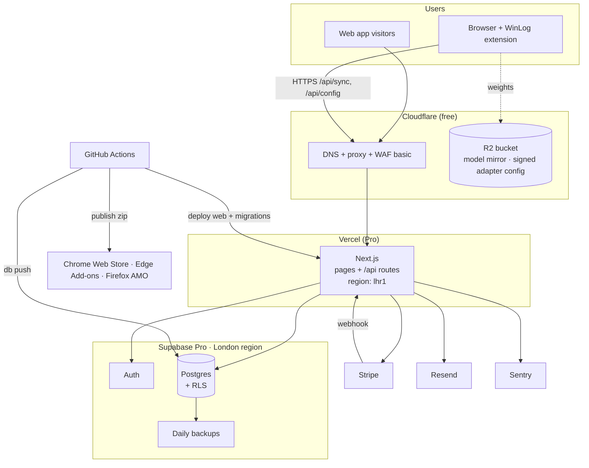
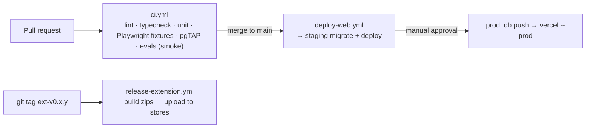
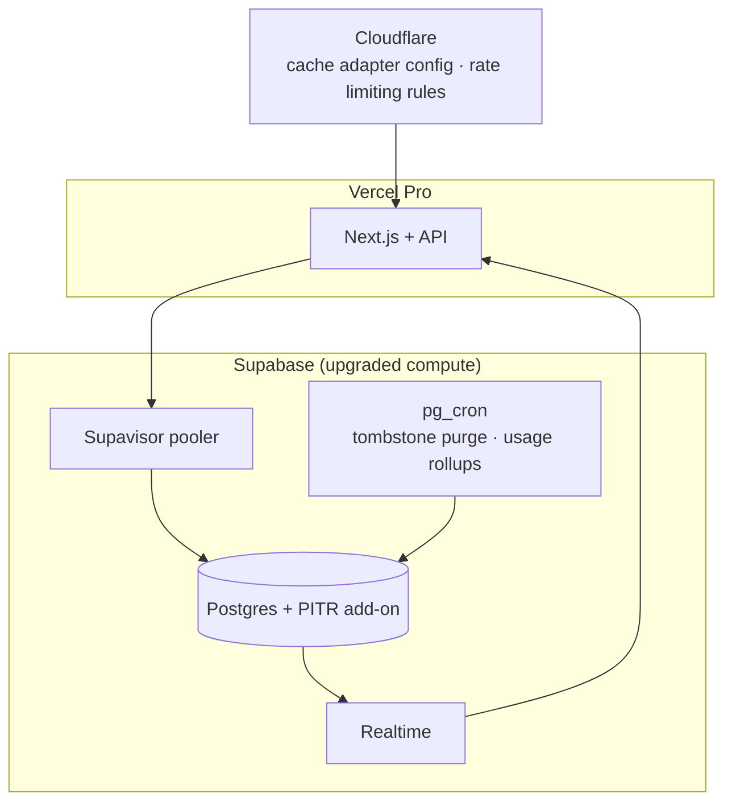
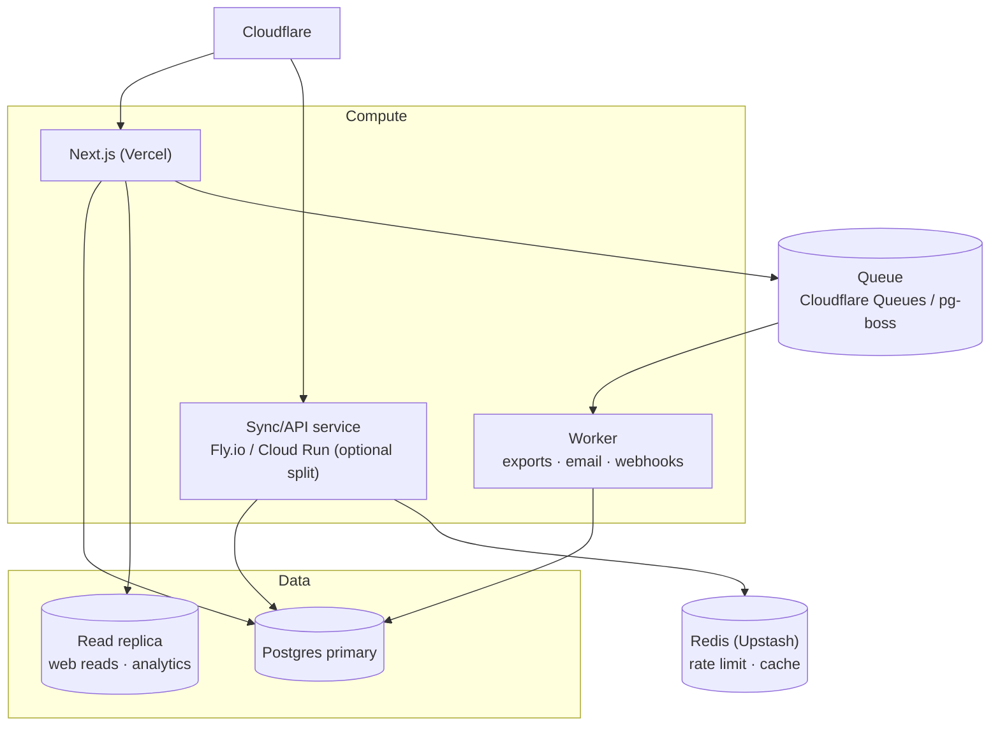

# WinLog — Infrastructure & Deployment Technical Specification

Companion to `ARCHITECTURE.md`. Covers how to provision, deploy, operate, and grow the system as **one founder on a bootstrap budget**.

> **Prices and limits** quoted here are approximate planning figures. Verify current plans for Vercel, Supabase, Cloudflare, Stripe, Sentry and the browser stores before committing. Replace `winlog.example` with your domain.

---

## 1. Principles

1. **Managed over self-hosted** until a metric says otherwise. Your time is the scarcest resource.
2. **Everything as code:** schema in `supabase/migrations`, pipelines in `.github/workflows`, provisioning in `infra/scripts`. No dashboard-only changes.
3. **Local-first means the cloud is small.** It stores approved achievements, resumes, cover letters and subscriptions — not evidence, not inference. That keeps load, cost and breach impact low.
4. **No GPU anywhere in the cloud.** All inference is on the user's device (decision D1). The biggest cost line of a typical AI startup does not exist here.
5. **Expand by triggers, not by calendar** (see §9).

---

## 2. Stage 0 topology (MVP → first ~2,000 users)



**Why this is enough:** sync payloads are tiny JSON rows; Next.js route handlers on serverless scale to zero; Postgres handles thousands of users on the smallest paid compute with proper indexes (§8).

### 2.1 Component inventory

| Component | Provider | Purpose | Region | Approx. cost/mo (verify) |
|-----------|----------|---------|--------|---------------------------|
| Domain | Registrar of choice | `winlog.example` | — | ~£1 |
| DNS/CDN/WAF | Cloudflare Free | Proxy, DNS, caching of config | global | £0 |
| Web hosting | Vercel Pro | Next.js UI + API | `lhr1` | ~$20 |
| DB + Auth | Supabase Pro | Postgres, Auth, backups | `eu-west-2` (London) | ~$25 |
| Object storage | Cloudflare R2 | Model mirror, adapter config | auto | ~£0–2 |
| Email | Resend | Transactional | EU | £0 → ~$20 |
| Payments | Stripe | Billing | — | % of revenue |
| Errors | Sentry (free/dev) | Web + extension error reports (scrubbed) | EU | £0 |
| CI/CD | GitHub Actions | Build/test/deploy | — | £0 (free minutes) |
| Store fees | Chrome Web Store | One-time developer fee (small) | — | ~$5 one-off |
| **Total fixed** | | | | **≈ £50–60/mo** |

Before the first paying user you can run on free tiers of Vercel (hobby is non-commercial — switch to Pro at launch) and Supabase (free projects pause on inactivity — fine for staging, not production).

---

## 3. Environments

| Env | Web | Database | Extension build | Purpose |
|-----|-----|----------|-----------------|---------|
| **local** | `next dev` | `supabase start` (Docker) | `wxt dev` with unpacked extension | Daily development |
| **staging** | Vercel preview/branch `staging` → `staging.winlog.example` | Supabase project `winlog-staging` | Unlisted/trusted-tester store build or sideloaded zip | Pre-release verification, beta |
| **prod** | Vercel production → `app.winlog.example` | Supabase project `winlog-prod` | Public store listing | Customers |

Rules: separate Supabase projects (never share a DB across envs), separate Stripe test/live modes, separate Sentry projects, distinct OAuth redirect URIs per extension ID.

> **Extension ID stability:** Chrome extension IDs differ between unpacked, staging and published builds unless you set a `key` in the manifest. Fix the key early so OAuth redirect URIs (`https://<ext-id>.chromiumapp.org/`) stay stable.

---

## 4. Provisioning runbook (do once, in order)

### 4.1 Accounts and hygiene (Day 1)

1. Create a **company email** and a **password manager** vault; enable hardware-key/TOTP 2FA on *every* account below (store accounts and registrar especially — a hijacked store account can push malware to users).
2. Register domain; put it behind Cloudflare (change nameservers).
3. Create a GitHub org/repo `winlog` (private). Enable branch protection on `main`, required checks, Dependabot, secret scanning.
4. Create accounts: Vercel, Supabase, Stripe, Resend, Sentry, Cloudflare, Chrome Web Store developer, Microsoft Partner Center (Edge), Firefox AMO.

### 4.2 Supabase (database + auth)

```bash
npm i -g supabase
supabase login
supabase init                                   # creates supabase/ if absent

# Create two projects in the dashboard (region: London / eu-west-2):
#   winlog-staging, winlog-prod
supabase link --project-ref <STAGING_REF>
supabase db push                                # applies supabase/migrations/*.sql

# Auth settings (dashboard → Authentication):
#   - Site URL: https://app.winlog.example   (staging: https://staging.winlog.example)
#   - Redirect URLs: https://<ext-id>.chromiumapp.org/*  and web callback URL
#   - Enable email magic link + Google (and Microsoft — your users live in Microsoft 365)
#   - Enable PKCE flow; disable sign-ups you don't want

# Run RLS tests locally and in CI:
supabase test db
```

Checklist: RLS enabled on every table (CI test fails if any table in `public` lacks it); service-role key copied **only** to Vercel server env; daily backup confirmed on the Pro plan.

### 4.3 Vercel (web + API)

```bash
npm i -g vercel
vercel link                                     # link apps/web
vercel env add SUPABASE_URL production
vercel env add SUPABASE_ANON_KEY production
vercel env add SUPABASE_SERVICE_ROLE_KEY production      # server-only
vercel env add STRIPE_SECRET_KEY production
vercel env add STRIPE_WEBHOOK_SECRET production
vercel env add RESEND_API_KEY production
vercel env add ADAPTER_CONFIG_SIGNING_KEY production     # ed25519 private key (never in extension)
vercel env add SENTRY_DSN production
# repeat for preview/staging with staging values
```

Set the function region to London (`lhr1`) so API ↔ Supabase latency stays in single-digit ms. Add `app.winlog.example` as the production domain; Cloudflare record = DNS-only or proxied per Vercel's guidance.

### 4.4 Cloudflare R2 (model mirror + signed config)

```bash
npm i -g wrangler
wrangler login
wrangler r2 bucket create winlog-assets
wrangler r2 object put winlog-assets/config/adapters.v1.json --file ./infra/adapters.v1.json
# Public access via custom domain assets.winlog.example (CORS: allow chrome-extension:// origins for GET)
```

You may skip R2 on day one and fetch weights from the upstream model hub; add the mirror when you want control over availability and file integrity (publish SHA-256 hashes; the extension verifies them).

### 4.5 Stripe

1. Create products/prices (Free is app logic; one paid plan to start).
2. Customer Portal enabled (cancel, update card).
3. Webhook endpoint `https://app.winlog.example/api/webhooks/stripe` for `checkout.session.completed`, `customer.subscription.updated`, `customer.subscription.deleted`.
4. Webhook handler writes `subscriptions` with the service role; entitlement checks in the web app read that table. **Idempotent** by Stripe event id.

### 4.6 Signing key for remote adapter config

```bash
# generate once, offline
openssl genpkey -algorithm ed25519 -out adapter-signing.pem
openssl pkey -in adapter-signing.pem -pubout -out adapter-signing.pub
# private → Vercel env; public → baked into the extension (apps/extension/src/adapters/config.ts)
```

The config contains selectors and heuristic keyword lists (data only). The extension verifies the signature and a monotonically increasing `version` before use. This lets you hot-fix a broken Slack/Teams selector in minutes without waiting days for store review.

### 4.7 Observability

- **Sentry** in the web app (server + client); in the extension, only error *types/stack traces* with message text scrubbed (`beforeSend` strips strings; never attach page content).
- **Uptime:** a free external pinger on `/api/health` (checks DB connectivity) with email/SMS alerts to you.
- **Product metrics (opt-in, extension):** counters only — `candidate_shown`, `evidence_saved`, `achievement_approved`, `letter_generated`, model tier, WebGPU yes/no. No content, ever.

---

## 5. CI/CD



```yaml
# .github/workflows/ci.yml
name: ci
on: [pull_request]
jobs:
  test:
    runs-on: ubuntu-latest
    steps:
      - uses: actions/checkout@v4
      - uses: pnpm/action-setup@v4
      - uses: actions/setup-node@v4
        with: { node-version: 22, cache: pnpm }
      - run: pnpm install --frozen-lockfile
      - run: pnpm turbo run lint typecheck test
      - uses: supabase/setup-cli@v1
      - run: supabase start && supabase test db      # RLS tests
      - run: pnpm --filter extension build           # catches manifest/permission drift
```

```yaml
# .github/workflows/deploy-web.yml
name: deploy-web
on:
  push: { branches: [main] }
jobs:
  staging:
    runs-on: ubuntu-latest
    environment: staging
    steps:
      - uses: actions/checkout@v4
      - uses: supabase/setup-cli@v1
      - run: supabase link --project-ref ${{ secrets.STAGING_REF }}
        env: { SUPABASE_ACCESS_TOKEN: ${{ secrets.SUPABASE_ACCESS_TOKEN }} }
      - run: supabase db push                         # migrations BEFORE code
        env: { SUPABASE_DB_PASSWORD: ${{ secrets.STAGING_DB_PASSWORD }} }
      - run: npx vercel deploy --prebuilt --token ${{ secrets.VERCEL_TOKEN }}   # preview/staging alias
  production:
    needs: staging
    runs-on: ubuntu-latest
    environment: production            # required reviewer = you (manual gate)
    steps:
      - uses: actions/checkout@v4
      - uses: supabase/setup-cli@v1
      - run: supabase link --project-ref ${{ secrets.PROD_REF }}
        env: { SUPABASE_ACCESS_TOKEN: ${{ secrets.SUPABASE_ACCESS_TOKEN }} }
      - run: supabase db push
        env: { SUPABASE_DB_PASSWORD: ${{ secrets.PROD_DB_PASSWORD }} }
      - run: npx vercel deploy --prod --token ${{ secrets.VERCEL_TOKEN }}
```

```yaml
# .github/workflows/release-extension.yml
name: release-extension
on:
  push: { tags: ['ext-v*'] }
jobs:
  release:
    runs-on: ubuntu-latest
    steps:
      - uses: actions/checkout@v4
      - uses: pnpm/action-setup@v4
      - uses: actions/setup-node@v4
        with: { node-version: 22, cache: pnpm }
      - run: pnpm install --frozen-lockfile
      - run: pnpm --filter extension zip && pnpm --filter extension zip:firefox
      - run: pnpm --filter extension publish:chrome     # e.g. chrome-webstore-upload / wxt submit
        env:
          CHROME_CLIENT_ID: ${{ secrets.CHROME_CLIENT_ID }}
          CHROME_CLIENT_SECRET: ${{ secrets.CHROME_CLIENT_SECRET }}
          CHROME_REFRESH_TOKEN: ${{ secrets.CHROME_REFRESH_TOKEN }}
      # Edge + AMO upload steps follow the same pattern
```

**Migration discipline (expand → migrate → contract):** a migration must work with both the *previous* and *next* app version, because the web deploy and DB push are not atomic and old extension builds live in the wild for weeks. Add columns/tables first; remove only after the last supported extension version no longer uses them. Maintain a `min_supported_ext_version` that `/api/sync` can enforce with a friendly "please update" response.

---

## 6. Release management for the extension

| Concern | Approach |
|---------|----------|
| Versioning | SemVer in `wxt.config.ts`; tag `ext-vX.Y.Z` triggers release. |
| Review latency | Chrome review can take from hours to days — plan releases accordingly; never couple a web deploy to an unreleased extension feature. |
| Staged rollout | Use store percentage rollout where available (start at 10–20%). |
| Fast fixes | Remote signed adapter config (data) covers selector/heuristic breakage without a store release. |
| Kill switch | The same config carries per-adapter `enabled` flags and a `minModelPrompt` version; if an adapter misbehaves, disable it remotely. |
| Rollback | Re-publish the previous zip with a higher version number (stores don't allow downgrades). |
| Compatibility | `/api/sync` returns `426 Upgrade Required` below `min_supported_ext_version`. |
| Listing assets | Privacy policy URL, permission justifications (write them once; reuse), screenshots, a short demo. |

---

## 7. Security operations

| Control | Implementation |
|---------|----------------|
| Secrets | Only in Vercel/GitHub secrets; rotate service-role and Stripe keys on a calendar (quarterly) and after any contributor/agent exposure. |
| Least privilege | Extension uses anon key + user JWT; service role is webhook-only; GitHub tokens scoped per workflow. |
| Dependency risk | Dependabot, `pnpm audit` in CI, lockfile pinned, minimal dependencies in the extension (supply-chain attack on an extension reaches users' work chats). |
| Store account | Hardware-key 2FA, recovery codes offline, a second trusted owner if you ever hire. |
| Data subject rights | `/api/account` export + delete; delete cascades via FKs; tombstone purge job; documented 30-day response process. |
| Incident response | One-page runbook (§10): contain → assess data scope → notify. Remember that raw evidence is not on your servers, which shrinks the blast radius. UK/EU breach reporting windows apply to personal data you do hold (emails, achievements, resumes). |
| Backups | Daily automated backups (Pro). Add point-in-time recovery when paying users justify it. **Test a restore into staging quarterly** and record the date. |
| Targets | RPO ≤ 24 h, RTO ≤ 4 h at Stage 0; tighten at Stage 2. |

---

## 8. Capacity model and database guidance

Planning assumptions (adjust with real data): average user stores ~200 achievements/year, 3 resumes, 10 cover letters; row sizes are small (≈0.5–2 KB; resume JSON ≈ 10–40 KB).

| Users | Approx. rows (achievements) | Approx. DB size | Sync requests (pull every 15 min, 2 devices) | Peak req/s (≈ users × 2 / 900 s × 3 burst) |
|-------|-----------------------------|-----------------|----------------------------------------------|----------------------------------------------|
| 2,000 | 400k | < 1 GB | ~4k per 15 min | ~13 |
| 20,000 | 4M | ~5–10 GB | ~40k per 15 min | ~130 |
| 200,000 | 40M | ~50–100 GB | ~400k per 15 min | ~1,300 |

**Takeaway:** the load that grows first is **sync polling**, not storage. Levers, in order:
1. `ETag/304` and the `since` cursor so empty pulls are a single indexed lookup.
2. Longer poll interval when idle; push-triggered pulls; jittered alarms to avoid thundering herd.
3. Supabase Realtime (or SSE) to replace polling for the web app.
4. Cache `GET /api/config/adapters` at the Cloudflare edge (it is public and identical for everyone).

**Indexing:** the `(user_id, rev)` index on each synced table serves the pull query. Verify with `EXPLAIN` at 100k rows seeded in staging. Use the pooled connection string (Supavisor / transaction mode) from serverless functions to avoid connection exhaustion.

---

## 9. Growth pathway

### 9.1 Stage map

| Stage | Trigger (any one) | Users (guide) | Main change | Fixed cost (guide) |
|-------|-------------------|---------------|-------------|--------------------|
| **0 — Launch** | MVP live | 0–2k | Topology in §2 | ~£50–60 |
| **1 — Traction** | p95 API > 400 ms, DB CPU > 60 % sustained, or Vercel function bill > ~$50 | 2k–20k | Larger Supabase compute, pooled connections, edge caching, Realtime instead of polling, queue-less background jobs via pg_cron | ~£150–350 |
| **2 — Scale** | DB > 100 GB, sustained > 100 req/s, or you need team/B2B features | 20k–200k | Read replica, dedicated worker service, Redis for rate-limit/cache, PITR, SSO, orgs | ~£600–2,000 |
| **3 — Platform** | Enterprise deals, data-residency demands, compliance asks | 200k+ | Multi-region, SOC 2 / ISO 27001 program, dedicated infra, partitioning | Custom |

### 9.2 Stage 1 — Traction



Actions:
- Upgrade Supabase compute one size; enable PITR; move all server queries to the pooled connection.
- Replace 15-min polling with Realtime notifications + a slow fallback poll.
- Add Cloudflare rate-limiting rules on `/api/sync/*` per IP/JWT.
- Add `pg_cron` for tombstone purge and nightly usage aggregates (no queue needed yet).
- Introduce a **status page** and a support inbox/help-centre.

### 9.3 Stage 2 — Scale



Actions:
- Split the **sync API** from the web app only if its traffic profile or cost justifies it; otherwise keep the monolith.
- Add read replica for web reads and reporting; keep writes on the primary.
- Add a queue for async work (data exports, account deletion, email campaigns).
- **B2B/team tier** (e.g. career-coach or outplacement firms): introduce `organizations` and `memberships` tables, add `org_id` to synced tables, update RLS to membership checks, add SAML SSO (via a managed provider rather than building it).
- Move the model mirror fully to R2 with versioned paths and hash manifests; add model-update channels so you can ship a better model without a store release.
- Consider an **opt-in cloud AI** feature for the *resume builder only* (never for evidence) — a deliberate product decision that needs its own privacy review and must not contradict D1/D3.

### 9.4 Stage 3 — Platform

- Multi-region (EU primary + US) with data-residency routing by account.
- Partition large tables by `user_id` hash or time if single-table size hurts vacuum/index performance (rarely needed before ~hundreds of millions of rows).
- Formal compliance (SOC 2 via an automation platform), pen-test, bug-bounty page, DPA templates.
- Evaluate dedicated infra (managed Postgres on a hyperscaler) only when the managed platform's cost/limits clearly bind.

### 9.5 Decision rules (so you don't over-build)

- Add **a queue** when a request handler needs to do >2 s of work or retry external calls.
- Add **Redis** when you have a measured hot-key or rate-limit need Postgres can't serve cheaply.
- Add **a second service** only when deploy cadence or scaling profile of the sync API diverges from the web app.
- Add **Kubernetes** never, unless you hire a platform engineer.

---

## 10. Operations runbooks

### Deploy
1. Merge to `main` → staging deploys automatically. 2. Smoke-test: sign in, approve achievement in the extension (staging build), see it on the web. 3. Approve the production job. 4. Watch Sentry + uptime for 30 min.

### Roll back web
`vercel rollback` (or promote the previous deployment). If a migration was applied, use the **expand/contract** rule — the previous code must still work with the new schema; if not, write a forward-fix migration (do not hand-edit prod).

### Roll back extension
Publish the last good build with a higher version; flip the remote kill-switch for the affected adapter immediately.

### Site breakage (Slack/Teams DOM changed)
1. Capture-health indicator or user report. 2. Reproduce against the fixture/test workspace. 3. Update selectors in remote config → sign → upload → verify version bump. 4. Add a Playwright fixture for the new DOM. 5. Ship code fix in the next extension release if config alone isn't enough.

### Database incident
Check Supabase status → connections/CPU → slow queries (`pg_stat_statements`) → add index/scale compute → if data damage, restore to a new project from backup/PITR, verify, then repoint. Record the timeline.

### Security incident
Revoke/rotate affected keys → disable the extension's sync via remote flag if needed → determine whether personal data was accessed → notify per UK/EU rules and affected users → post-mortem.

### Account deletion request
`DELETE /api/account` → cascades delete rows → Stripe customer deletion/anonymisation per retention law → confirm email. Local data remains on the user's device until they wipe it (the extension offers "delete all local data").

---

## 11. Cost control and unit economics

- **Cloud cost per user is tiny** because there is no inference. Dominant variable costs: Supabase compute/egress, Vercel function invocations, email.
- Keep payload sizes small (resume JSON ≤ 100 KB limit) and enforce per-user quotas (e.g. 5,000 achievements, 20 resumes) to prevent abuse.
- Monthly review (15 minutes): bills, Sentry error rate, sync p95, store-review status, top support issues.
- Revenue guardrail: don't move up a stage unless cost per active user at the new stage is < ~15–20 % of ARPU.

---

## 12. Go-live checklist

**Infrastructure**
- [ ] Prod and staging fully separate (DB, Stripe mode, Sentry, OAuth URIs)
- [ ] RLS on all tables; pgTAP cross-tenant tests green
- [ ] Backups confirmed; one restore rehearsed
- [ ] Secrets only in secret stores; service-role key server-only
- [ ] `/api/health` monitored with alerting
- [ ] Rate limits on `/api/sync/*`
- [ ] Stripe webhook verified and idempotent; Customer Portal live

**Extension**
- [ ] Stable extension ID (`key`) and registered redirect URIs
- [ ] Minimal permissions with written justifications
- [ ] Signed adapter config live; kill-switch tested
- [ ] Model download: resume, progress, integrity hash verified
- [ ] Heuristic-only mode works with no WebGPU
- [ ] "Delete all local data" and JSON export tested

**Legal / trust**
- [ ] Privacy policy states: evidence stays on device; only approved achievements sync
- [ ] Terms, DPA list of processors, cookie notice for the web app
- [ ] Per-site capture opt-in and first-run explainer
- [ ] Solicitor review of platform-terms and employer-policy exposure

**Operational**
- [ ] Runbooks (§10) in `docs/`
- [ ] Support inbox + status page
- [ ] Closed-beta cohort recruited (20–50 users) with a feedback channel
